# 🚀 Automated Cloud Application & Observability Stack

A production-grade SRE project simulating real-world cloud infrastructure: automated deployment, containerization, CI/CD pipeline, and full observability with chaos engineering.

---

## 📐 Architecture

```
Developer
    │
    ▼
GitHub Repository
    │
    ▼
GitHub Actions (CI/CD)  ──── SSH ────▶  AWS EC2 Instance
                                              │
                              ┌───────────────┼───────────────┐
                              ▼               ▼               ▼
                        FastAPI App      Prometheus        Grafana
                        (Port 80)       (Port 9090)      (Port 3000)
                              │               ▲
                              └── /metrics ───┘
```

---

## 🛠️ Tech Stack

| Category | Technologies |
|---|---|
| Cloud | AWS EC2, VPC, Security Groups |
| Infrastructure as Code | Terraform |
| Backend | Python, FastAPI, prometheus_client, psutil |
| Containerization | Docker, Docker Compose |
| CI/CD | GitHub Actions |
| Monitoring | Prometheus |
| Visualization | Grafana |
| OS | Ubuntu Linux |

---

## 📸 Screenshots

### AWS EC2 Instance Running
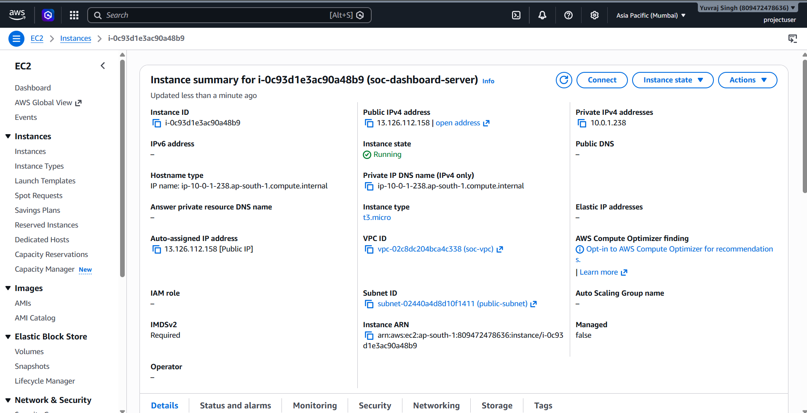

### Terraform Output — Public IP Created
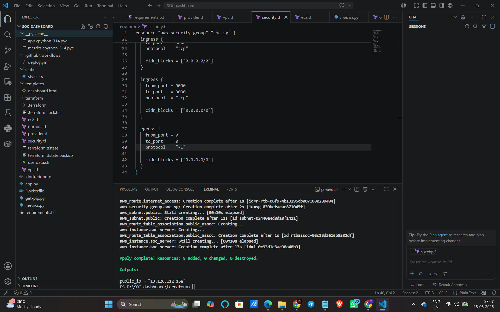

### Cloning Repo to EC2
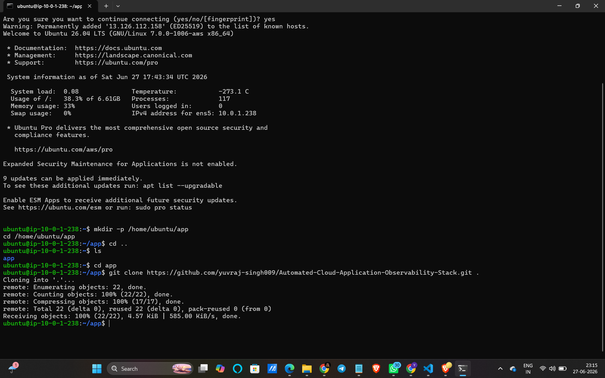

### Docker Image Build
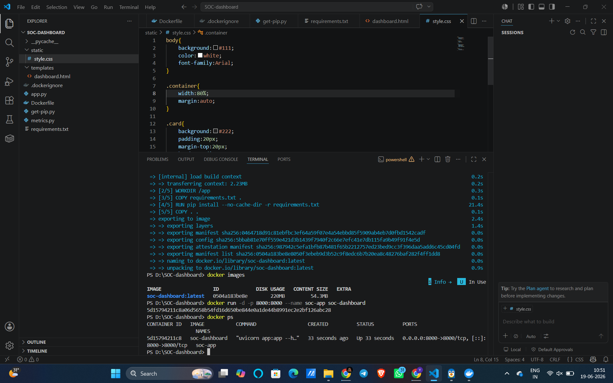

### Application Live on EC2
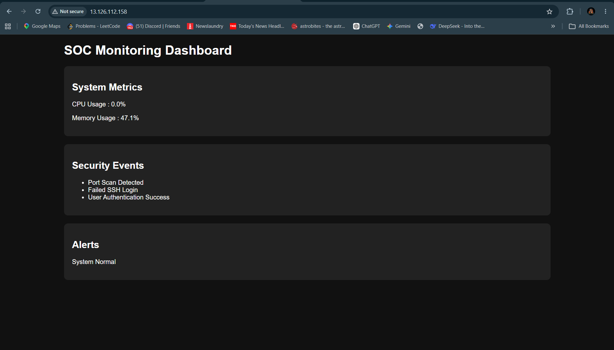

### App /metrics Endpoint
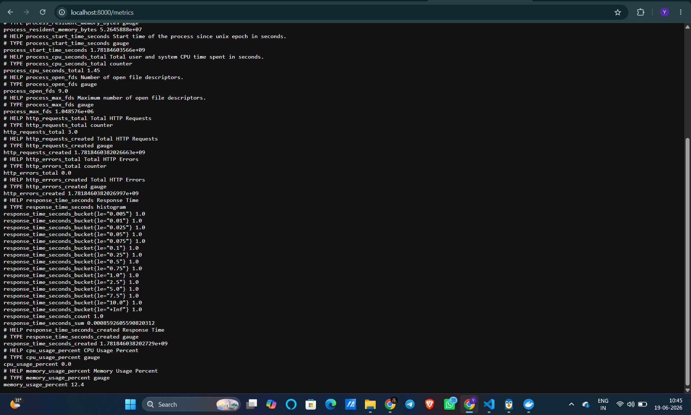

### Prometheus Targets — All UP
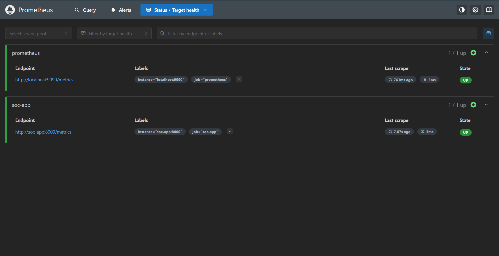

### Prometheus Query
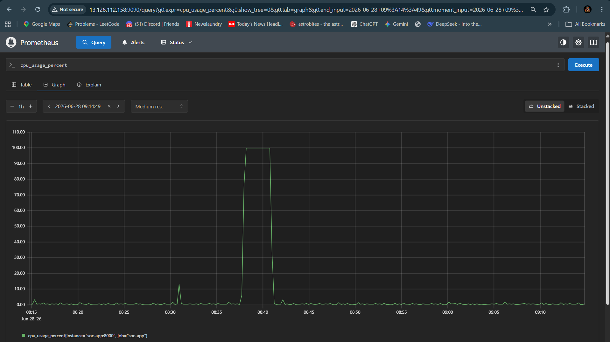

### Grafana Dashboard — Normal State
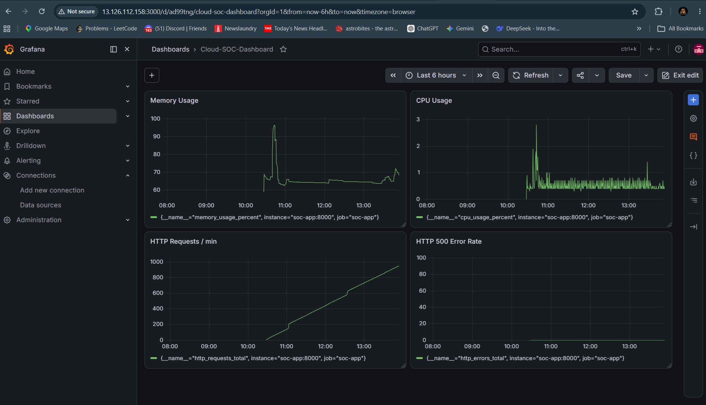

### Chaos Engineering — Stress Test Running on EC2
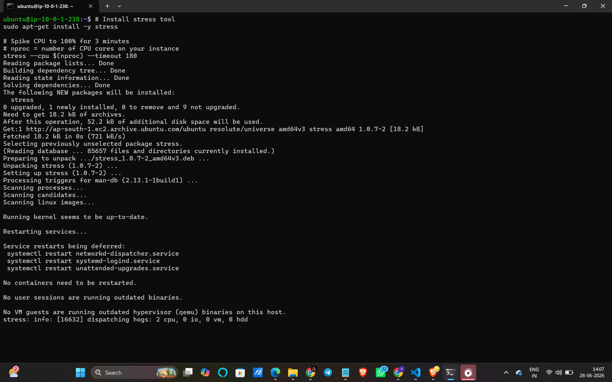

### Chaos Engineering — CPU Spike on Grafana
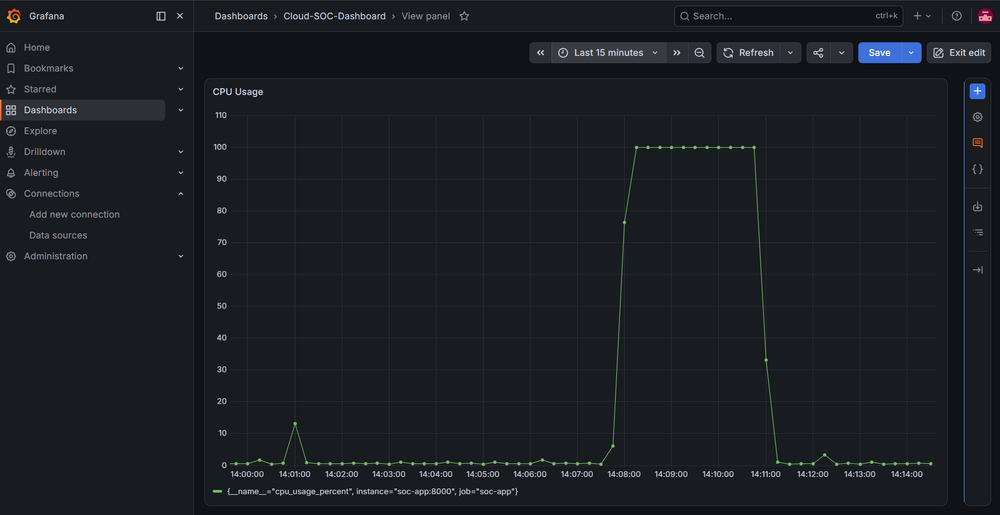

### GitHub Actions — Pipeline Success
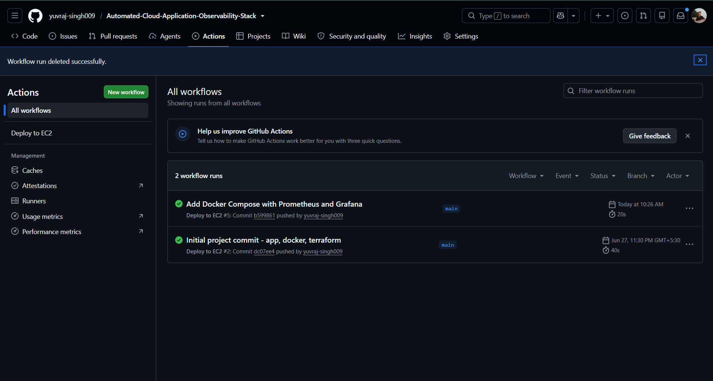

### Final File Structure
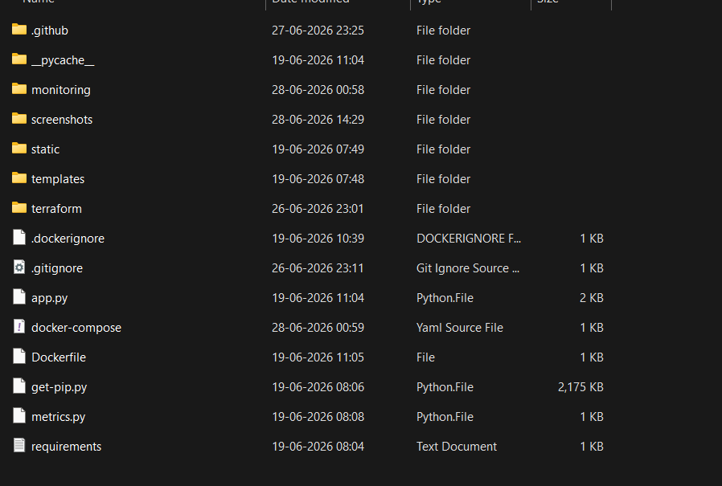

---

## 📁 Project Structure

```
├── .github/
│   └── workflows/
│       └── deploy.yml          # GitHub Actions CI/CD pipeline
├── monitoring/
│   └── prometheus.yml          # Prometheus scrape config
├── screenshots/                # Project screenshots
├── static/                     # Frontend assets
├── templates/                  # HTML templates
├── terraform/                  # AWS infrastructure as code
│   ├── main.tf
│   ├── ec2.tf
│   ├── vpc.tf
│   ├── security_group.tf
│   └── userdata.sh
├── app.py                      # FastAPI application
├── metrics.py                  # Prometheus metrics definitions
├── Dockerfile
├── docker-compose.yml          # Runs app + Prometheus + Grafana
└── requirements.txt
```

---

## 🔧 How to Run This Project

### Phase 1 — Application Setup

**Install dependencies and run locally:**

```bash
pip install -r requirements.txt
uvicorn app:app --reload
```

Visit `http://localhost:8000` to see the app running locally.

**Build and run with Docker:**

```bash
# Build the image
docker build -t soc-dashboard .

# Run the container
docker run -d -p 8000:8000 --name soc-app soc-dashboard

# Verify it's running
docker ps

# Stop and remove when done
docker stop soc-app
docker rm soc-app
```

---

### Phase 2 — Infrastructure as Code (Terraform + AWS)

**Prerequisites:**
- Install [Terraform](https://developer.hashicorp.com/terraform/install) and add it to PATH
- Install [AWS CLI](https://aws.amazon.com/cli/)
- Configure AWS credentials:

```bash
aws configure
```

**Terraform commands:**

```bash
cd terraform/

terraform init        # Download required providers
terraform validate    # Check config for errors
terraform plan        # Preview what will be created
terraform apply       # Provision AWS infrastructure
terraform destroy     # Tear down all resources
```

This provisions: VPC, public subnet, internet gateway, route tables, security group, and EC2 instance with Docker pre-installed via user data script.

---

### Phase 3 — Git Setup & CI/CD Pipeline

**Initialize Git and push to GitHub:**

```bash
git init
git remote add origin https://github.com/yuvraj-singh009/Automated-Cloud-Application-Observability-Stack.git
git add .
git status
git commit -m "Initial project commit - app, docker, terraform"
git push -u origin main
```

**For future pushes:**

```bash
git add .
git commit -m "Your descriptive message here"
git push
```

**One-time setup — clone repo onto EC2:**

```bash
# SSH into EC2
ssh -i /path/to/soc-key.pem ubuntu@YOUR_EC2_IP

# Create app directory and clone repo
mkdir -p /home/ubuntu/app
cd /home/ubuntu/app
git clone https://github.com/yuvraj-singh009/Automated-Cloud-Application-Observability-Stack.git .
```

**Push the CI/CD workflow to trigger GitHub Actions:**

```bash
git add .github/workflows/deploy.yml
git commit -m "Add CI/CD pipeline"
git push origin main
```

From this point, every push to `main` automatically:
1. SSHs into EC2
2. Pulls latest code
3. Rebuilds Docker image
4. Restarts all containers

Your app will be live at `http://YOUR_EC2_IP`

---

### Phase 4 — Observability (Prometheus + Grafana)

The `monitoring/prometheus.yml` and `docker-compose.yml` files wire everything together. Push them to GitHub and the CI/CD pipeline deploys the full stack automatically.

**After deployment, access:**

| Service | URL |
|---|---|
| Application | `http://YOUR_EC2_IP` |
| App Metrics | `http://YOUR_EC2_IP/metrics` |
| Prometheus | `http://YOUR_EC2_IP:9090` |
| Grafana | `http://YOUR_EC2_IP:3000` |

Grafana default login: `admin` / `admin`

**In Grafana, add these dashboard panels:**

| Panel | PromQL Query |
|---|---|
| CPU Usage | `cpu_usage_percent` |
| Memory Usage | `memory_usage_percent` |
| HTTP Requests/min | `rate(http_requests_total[1m]) * 60` |
| HTTP 500 Error Rate | `rate(http_errors_total[1m]) * 60` |

---

### Phase 5 — Chaos Engineering

Simulate a production CPU failure to validate the monitoring stack:

```bash
# SSH into EC2
ssh -i /path/to/soc-key.pem ubuntu@YOUR_EC2_IP

# Install stress tool
sudo apt-get install -y stress

# Spike CPU to 100% for 3 minutes
stress --cpu $(nproc) --timeout 180
```

Watch the CPU Usage panel on Grafana spike in real time. This validates that the observability stack correctly detects and visualizes production failures.

---

## 💼 Key SRE Concepts Demonstrated

| Concept | Implementation |
|---|---|
| Infrastructure as Code | Entire AWS setup in Terraform — reproducible with one command |
| Containerization | App, Prometheus, Grafana all running as isolated Docker containers |
| CI/CD Automation | Zero-touch deployment via GitHub Actions on every git push |
| Metrics & Monitoring | RED method — Rate, Errors, Duration tracked in Grafana |
| Chaos Engineering | Intentional failure injection to validate monitoring alerting |
| Observability Pipeline | App → `/metrics` → Prometheus (15s scrape) → Grafana dashboards |